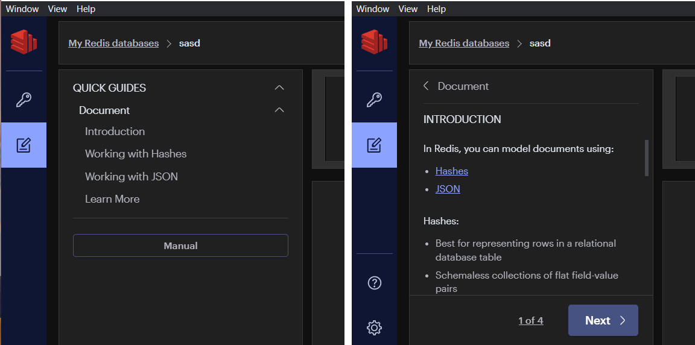
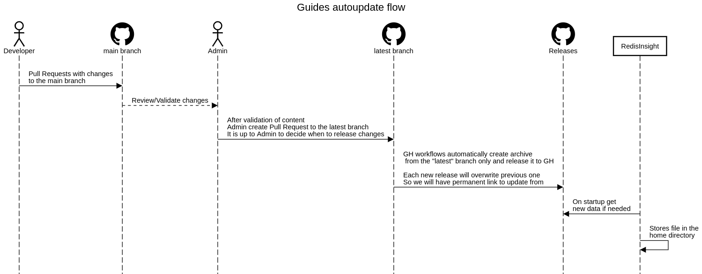

## Introduction


The Quick Guides are documents that contain sets of instructions, commands, and comments. Users can use built-in guides in order to gain an understanding of a certain Redis subject, which accelerates the adoption of Redis features among the Redis community.

The content of the Quick Guides can be updated independently without a need to update the entire application.

This document provides an overview of the Quick Guides structure, its elements and contains instructions, recommendations, and best practices for updating the content of Quick Guides.

## Navigation

1. [Examples](#Examples)
2. [Structure](#Structure)
3. [Pages](#Pages)
4. [Autoupdate Flow](#Autoupdate)
5. [Development Flow](#Development)

## Examples
Download this example with Redis Stack Tutorials and upload the archive using the "Upload Tutorial" feature in Workbench so you can view and work with them in RedisInsight.

[Redis Stack Tutorials.zip](https://github.com/RedisInsight/Guides/raw/main/files/Redis.Stack.Tutorials.zip)

To upload your own tutorials, specify a link or folder path to a .zip archive with your tutorials.

Below you can find information about the structure and logic for creating your own tutorials.


## Structure
Quick Guides allows you to render recursive objects, such as a file directory.

On the root level of guides folder, we have `manifest.json` and all necessary static files (markdowns, images, etc.)

The content of this area is generated based on Nodes specified inside `manifest.json`.
This JSON file is described as a simple [Objects](https://javascript.info/object) which represents tree node and might have children nodes inside.

Manifest file should start with single Node and should have properties described 
below (it will be displayed as type "group"):

| Prop                    | Type                     | Description                                                                                                                   |
|-------------------------|--------------------------|-------------------------------------------------------------------------------------------------------------------------------|
| label (**required**)    | string                   | Label that will be displayed on UI for Node                                                                                   |
| children (**required**) | Node[]                   | List of Nodes (nested groups or markdown files)                                                                               |
| type                    | "group", "internal-link" | This field is **required** for default guides, for user guides no reason to specify anything - it will be override to "group" |
| keywords                | string[]                 | Used for tags/labels                                                                                                          |
| author                  | string                   | Author name                                                                                                                   |
| URL                     | string                   | Link to repository/web-site                                                                                                   |
| industry                | string[]                 | Tags to show relevant industry                                                                                                |
| description             | string                   | Short description of tutorials                                                                                                |

Each Node requires a `label`,`type` (all available properties are described in the table below).

| Prop                 | Type                     | Description                                                                            |
|----------------------|--------------------------|----------------------------------------------------------------------------------------|
| id                   | string                   |                                                                                        |
| type (**required**)  | "group", "internal-link" |                                                                                        |
| label (**required**) | string                   | Label that will be displayed on UI for Node                                            |
| children             | Node[]                   | Use only for "group" type                                                              |
| args                 | Record<string, any>      | A special set of parameters required by a certain type of node (each type has its own) |

A Node can be represented by various UI components and is specified by `type` prop. Supported types are listed below.

| Type            	     | Description                                                                          	   | Args                                                                                         |
|-----------------------|------------------------------------------------------------------------------------------|----------------------------------------------------------------------------------------------|
| **"internal-link"** 	 | A link that opens a page inside the Enablement Area <br> (e.g. link to guide page).      | - "path" (required, string) - relative file path                                             |
| **"group"**         	 | Grouping several nodes into one directory/folder. <br> Allows you to create nested lists | - "initialIsOpen" (boolean) - The group will start in the open state (default value - false) |

> _**!Note.** All **"internal-link"** nodes located in the same **"group"** will be connected to each other. And using pagination (created dynamically) you can go directly from one page to another. Therefore, it is best to combine elements into groups related to the same topic._

### Example with "Document" group and two guides inside it
```json
  {
    "type": "group",
    "id": "document",
    "label": "Document",
    "args": {
      "initialIsOpen": true
    },
    "children": [
      {
        "type": "internal-link",
        "id": "introduction",
        "label": "Introduction",
        "args": {
          "path": "/quick-guides/document/introduction.md"
        }
      },
      {
        "type": "internal-link",
        "id": "learn-more",
        "label": "Learn More",
        "args": {
          "path": "/quick-guides/document/learn-more.md"
        }
      }
    ]
  }
```
## Pages
By using **"internal-link"** node we can open some [Markdown Guides](https://www.markdownguide.org/) located in guides folder.

These guides may contain the following elements:
* Plain text
* [Basic Markdown Syntax](https://www.markdownguide.org/basic-syntax/)
* [Extended Markdown Syntax](https://www.markdownguide.org/extended-syntax/)
* [HTML tags](https://www.markdownguide.org/basic-syntax/#html)
* Images
* Custom Syntax

### Images
Basic Markdown syntax provides the ability to render images. ([Image Markdown Syntax](https://www.markdownguide.org/basic-syntax/#images-1))

You can use the absolute path
```

```
or relative path to image inside the guides folder
```

```

#### Redis Code block


###### Manual-execute button
A button that inserts Redis commands in the Editor. The syntax is almost the same as for the [Fenced Code Block](https://www.markdownguide.org/extended-syntax/#fenced-code-blocks),
the only difference is that you must specify `redis` as language and the label next to it (`Create` in the example below).
````
 ```redis Create
    // Let's add three documents as Hashes.
    // Each document represents a building permit.

    HSET permit:1 "description" "To reconstruct a single detached house with a front covered veranda." "construction_value" 42000 "building_type" "single detached house" "address_city" "Lisbon" "work_type" "demolition,reconstruction" "permit_timestamp" "1602156878" "address_street" "R. Da Palma" "location" "38.717746, -9.135839"

    HSET permit:2 "description" "To construct a loft" "construction_value" 53000 "building_type" "apartment" "address_city" "Porto" "work_type" "construction" "permit_timestamp" "1556546400" "address_street" "Rua da Boavista" "location" "41.155854, -8.616721"

    HSET permit:3 "description" "New house build" "construction_value" 260000 "building_type" "house" "address_city" "Lagos" "work_type" "construction;design" "permit_timestamp" "1612947600" "address_street" "R. Antonio Gedeao" "location" "37.114864, -8.668521"

 ```
````

###### Button parameters

You can customize the run parameters to configure the raw mode, pipeline parameter and group mode. If specified, they will override
the configuration set in RedisInsight. If not specified - the behaviour will be defined by parameters set in RedisInsight.
To specify the parameters, insert them after the `redis-auto:` and add the parameters in square brackets separated with a semicolon (`;`) in
the following way:

```
redis:[<parameter1>;<parameter2>;<...>;<parameterN>]
```

Ensure that all the parameters are listed **without spaces**, ordering does not matter.

_Supported parameters:_

| Name     | Values                   | Notes                                     | Description                                                                                                                                              |
|----------|--------------------------|-------------------------------------------|----------------------------------------------------------------------------------------------------------------------------------------------------------|
| results  | * _single_<br/>* _group_<br/>* _silent_ | If enabled, then pipeline mode is ignored | * _single_ - Disable the group mode to display the command results in a batch or as separate ones.<br/>* _group_ - Enable the group mode <br/>* _silent_:  <br/>&emsp; 1. Enable the group mode <br/>&emsp; 2. Auto collapse the result <br/>&emsp; 3. Show only error commands in the results|
| mode     | * _ascii_<br/>* _raw_    |                                           | Enable/disable the raw mode to display command results.                                                                                                                        |
| pipeline | any integer number       |                                           | Configure the number of commands in the pipeline. 0 or 1 pipelines every command.                                                     |
| auto | * _true_<br/>* _false_       |                                           | Configure the auto execute commands after click on the button |


_Notes:_

* Ensure that there are no spaces
* All the parameters with mistakes will be ignored

_Examples:_

```
redis:[results=single]
redis:[auto=true;mode=raw]
redis:[pipeline=1]
redis:[results=silent;mode=raw]
redis:[results=single;pipeline=4]
redis:[results=group;mode=ascii]
redis:[auto=true;pipeline=8;mode=raw;results=single;]
```

###### Auto-execute button


A button that automatically executes the Redis commands (without inserting it into the Editor). Such buttons will be displayed with the "Play" icon inside.
The code syntax is the same as for the manually executed buttons, just insert parameter `[auto=true]` with any other parameters before the button.

````
 ```redis:[auto=true;mode=raw] Create
    // Let's add three documents as Hashes.
    // Each document represents a building permit.

    HSET permit:1 "description" "To reconstruct a single detached house with a front covered veranda." "construction_value" 42000 "building_type" "single detached house" "address_city" "Lisbon" "work_type" "demolition,reconstruction" "permit_timestamp" "1602156878" "address_street" "R. Da Palma" "location" "38.717746, -9.135839"

    HSET permit:2 "description" "To construct a loft" "construction_value" 53000 "building_type" "apartment" "address_city" "Porto" "work_type" "construction" "permit_timestamp" "1556546400" "address_street" "Rua da Boavista" "location" "41.155854, -8.616721"

    HSET permit:3 "description" "New house build" "construction_value" 260000 "building_type" "house" "address_city" "Lagos" "work_type" "construction;design" "permit_timestamp" "1612947600" "address_street" "R. Antonio Gedeao" "location" "37.114864, -8.668521"

 ```
````

## Autoupdate
> _Works only with default guides_

Our application supports the ability to quickly update the static files of the Enablement area so that we can provide users with up-to-date information.

EA guides auto-update flow:
1. Push commit with updates to `/guides` repository branch
2. Approve guides release in CircleCI.
3. Reopen the Redisinsight with a working internet connection. In the background, new files will be downloaded to the user's local home directory:
    * **Mac**: In the `/Users/<your-username>/.redisinsight-v2/guides` directory.
    * **Windows**: In the `C:\Users\<your-username>\.redisinsight-v2\guides` directory.
    * **Linux**: In the `/home/<your-username>/.redisinsight-v2/guides` directory.
4. Open Enablement area on UI



## Development
Let's imagine that we need to add a new group (Streams) with 2 pages (Basics, Getting data).

Step by step implementation would be as follows:
1. First of all, it's best to create new pages locally and make sure that everything looks like it was planned.
2. Clone Guides repository (if you haven't done it before) and go into `<folder to guides repo>/src`
3. Create a new branch from the `main`
4. Add new `streams` folder with `basics.md` and `getting-data.md`. As a result, the folder structure will look something like this.
```
guides
 > quick-guides
   > document
   > streams
     basics.md
     getting-data.md
 manifest.json
```
5. Add new nodes inside `manifest.json`
```json
  {
    "type": "group",
    "id": "quick-guides",
    "label": "QUICK GUIDES",
    "children": [
      {
        "type": "group",
        "id": "streams",
        "label": "Streams",
        "children": [
          {
            "type": "internal-link",
            "id": "basics",
            "label": "Basics",
            "args": {
              "path": "/quick-guides/streams/basics.md"
            }
          },
          {
            "type": "internal-link",
            "id": "getting-data",
            "label": "Get Data",
            "args": {
              "path": "/quick-guides/streams/getting-data.md"
            }
          }
        ]
      }
    ]
  }
```
6. Fill markdowns with content.

`basics.md`
````
For the goal of understanding what Redis Streams are and how to use them, we will ignore all the advanced features, and instead focus on the data structure itself, in terms of commands used to manipulate and access it.
This is, basically, the part that is common to most of the other Redis data types, like Lists, Sets, Sorted Sets and so forth.
However, note that lists also have an optional more complex blocking API, exported by commands like BLPOP and similar.
So streams are not much different than lists in this regard, it's just that the additional API is more complex and more powerful.

Because Streams are an append-only data structure, the fundamental write command, called **XADD**, appends a new entry into the specified stream.
A stream entry is not just a string but is instead composed of one or multiple field-value pairs.
This way, each entry of a stream is already structured, like an append-only file written in CSV format where multiple separated fields are present in each line.

```redis Create
XADD mystream * sensor-id 1234 temperature 19.8
```

````

`getting-data.md`
````
Querying by range: **XRANGE** and **XREVRANGE*
To query the stream by the range we are only required to specify two IDs, _start_ and _end_.
The range returned will include the elements having start or end as ID, so the range is inclusive. The two special IDs - and + respectively mean the smallest and the greatest ID possible.

```redis XRANGE
XRANGE mystream - +
```

```redis XREVRANGE
XREVRANGE mystream + - COUNT 1
```


````
7. Open **RedisInsight** application with `GUIDES_DEV_PATH` environment variable `GUIDES_DEV_PATH='<path to Guides repo>/src' ./<path to RedisInsight binary>`

   Example on Linux: `GUIDES_DEV_PATH='/home/user/projects/Guides/src' ./home/user/programms/RedisInsight.AppImage`
8. Make sure that everything looks fine.


9. After that, just commit and push, and then create Pull Request to the main branch. (Release flow described in the [Autoupdate Flow](#Autoupdate) section).
